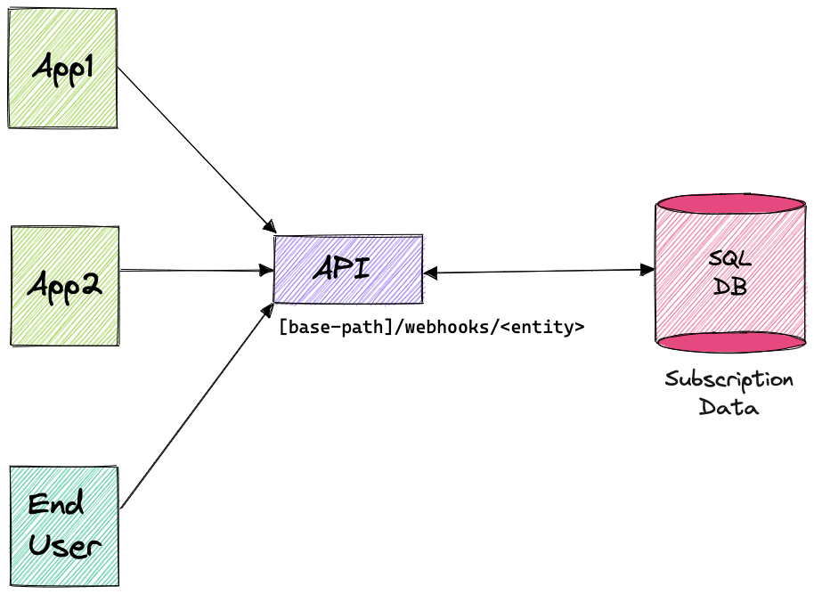
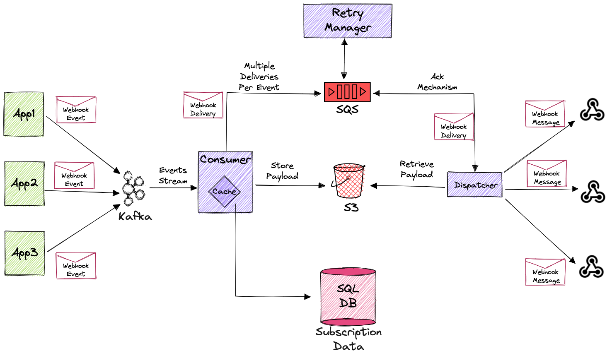

# Building a scalable webhook delivery system using Kafka, SQS & S3

As the world gets more and more connected, software applications are of course no exception. Apps need a way to have 2 or more completely separated systems share information.

**Webhooks** are automated messages sent from apps when something happens. They have a message (or payload), and are sent to a unique URL. Webhooks are almost always faster than polling, which makes them an ideal solution for pushing events from a system to the outside world.

They are widely used in industry giants like Shopify, Stripe, Twitter & Twilio. If you look at PayPal, webhooks are how PayPal tells your eCommerce app that your clients paid you.

In this post I'll introduce my webhook delivery system solution using Apache Kafka, AWS SQS and S3. In the past, my company had different implementations for sending out events via webhooks in different products. We decided to consolidate them into a single unified solution.

So, if you're considering building your own webhook delivery system, this blog is for you!

## Defining the requirements
Let's look at what we wanted to get from the new webhook delivery system, and why:

- **Scalability** - system needs to be able to adapt to changes and different loads using horizontal scalability

- **Retry Support** - sending webhooks can sometimes fail, due to a problem on the receiving end (bug, system is down, etc.). We could just discard the failed messages, but this would result in data loss for the receiver. We need a mechanism to retry the operation with exponential backoff and within up to 24h
- **Large Payload Support** - webhook events might have a large payload of a few MB
- **Payload Agnostic** - no knowledge of the meaning of the message's content is needed (nor even possible). Message’s payload is delivered as-is. This is crucial for having one solution to handle many different business use cases
- **Deduplication of Delivery** - all webhook events will get to their destination, but perhaps more than once. We’ll have a unique event id for deduplication purposes
Public REST API - necessary for registering webhooks

## We did allow ourselves some leniency:
- **No Order Guarantee** - we do not guarantee any order for webhook events
- **Handle HTTP/S communication only** - sending webhooks in any other type of communication manner (e.g., Apache Kafka, TCP, etc.) will not be supported

## Building the functionality
Right off the bat it was clear to us that our system would have 2 main tiers: The **API** (used for configurations) and the **Brain** (actual sending of webhook events). Let’s look at each of them separately…

### The API Tier
Used for registering and configuring webhooks. We decided to go for the most straightforward solution and have a REST API. The API can be used by an end user (the webhook subscriber) or by another application.



The endpoints URL is structured as `[base-path]/webhooks/<entity>`.

Defined 3 object types:

1. Webhook Target - an entity that encapsulates the target URL of the webhook
    ```
    {
        "id": 111111111,
        "url": "http://www.dummy.com",
        "createdAt": "2021-10-03T17:14:23Z",
        "updatedAt": "2021-10-03T17:14:23Z"
    }
   ```
   
2. Webhook Filter - an entity containing a list of event types a user wants to listen on (essentially an event group)
    ```json
    {
        "id": 222222222,
        "events": [
            "core.orders.created.v1",
            "core.orders.updated.v2"
        ],
        "createdAt": "2021-10-03T17:14:23Z",
        "updatedAt": "2021-10-03T17:14:23Z"
    }
    ```
    
3. Webhook Subscription - an entity that holds a combination of webhook target and webhook filter. Webhooks events will only be sent to active subscriptions
    ```json
    {
        "id": 123456789,
        "targetId": 111111111,
        "filterId": 222222222,
        "active": true,
        "createdAt": "2021-10-03T17:14:23Z",
        "updatedAt": "2021-10-03T17:14:23Z"
    }
    ```

Each entity has support for the following operations:

1. **GET BY ID** (_GET_ `/webhooks/<entity>/<entity_id>`)
2. **GET ALL** (_GET_ `/webhooks/<entity>`)
3. **CREATE** (_POST_ `/webhooks/<entity>`)
4. **UPDATE** (_PATCH_ `/webhooks/<entity>/<entity_id>`)
5. **DELETE** (_DELETE_ `/webhooks/<entity>/<entity_id>`)

To create a webhook there is a 3 step process:
1. Create a **Webhook Target** that will point to the location you want the webhook message to be sent to.
2. Create a **Webhook Filter** that will tell which events are to be sent as webhook messages.
3. Create a **Webhook Subscription** to bind a target and a filter. **Only when this step is completed, will actual webhook messages be sent**.

### The Brain Tier
The tier that will be responsible for the actual sending of webhooks. It is sensible to break it down to even smaller pieces, allowing us to scale different areas of the system independently from other areas that do not need the same scaling.



First, let’s define some simple terminology:

1. **Webhook Event** - the event received from other applications
2. **Webhook Delivery** - a combination of a Webhook Target and a Webhook Event. Since each event might interest multiple targets, it is duplicated per target
3. **Webhook Message** - the actual data sent to the target URL

#### The Consumer
The consumer handles webhook events from Kafka and decides (based on the subscription data) what Webhook Targets are applicable. Once deciding that, it generates a Webhook Delivery for each target that needs to get the event, and publishes it to an AWS SQS queue.

Since SQS has a limit of 256KB per message, and we have larger messages than that, we store the message payload in S3 for future retrieval.

#### The Cache
Events are very frequent in the system, and for each of them we need to match all relevant subscriptions defined in the subscriptions data DB. To not put strain on the DB, we hold in memory a local cache with the subscription configuration.

#### The Dispatcher
The dispatcher is the part of the system that performs the actual sending of the event payload as a Webhook Message to the relevant URL. It gets the delivery created by the consumer from the AWS SQS queue, and performs an HTTP POST call to the desired URL with the delivery payload. It is a separate module in order to allow dealing with performance interference issues, but more on that later.

#### The Retry Manager
As mentioned in the requirements, sending webhooks can fail, so we must have a mechanism to retry the operation (exponential backoff within up to 24h). After failing to find an existing solution that meets our requirements, we decided to implement it ourselves, using the power of SQS delayed messages and S3 for payload storage. For an in-depth dive into this topic, please refer to my upcoming blog post (link at the end of this post).

## Putting it all together

## System flow

1. Using the **API**, a new webhook is defined (target, filter & subscription) and saved to the subscription data DB. This is done once, and from that point forward relevant events will be sent as webhook messages.

2. Once something happens in a system that uses the webhooks delivery system (marked as App1 in diagram), it should send a message to a dedicated **Kafka topic** with the payload of the event and the type of the event. Here is the schema for such a message:
    ```json
    {
      "type": "record",
      "name": "WebhookEvent",
      "namespace": "com.yotpo.platform.webhookdelivery.messages",
      "fields": [
        {
          "name": "event_type",
          "type": "string"
        },
        {
          "name": "payload",
          "type": "string"
        }
      ]
    }
    ```

3. The **consumer** polls the message from the **Kafka topic**, and uses the definitions that were made before in the **API** and stored in the local cache. It then decides whether there exists a subscription that uses a filter in which the current type of event is defined. If so, it gathers all of the subscriptions that got matched, and creates a delivery message for all of the targets defined in them. The deliveries that were created are sent to an **SQS queue**.

4. The dispatcher polls the webhook deliveries from the SQS queue and sends it to the target. If the dispatcher gets a link to S3 for the payload, it fetches it before sending the delivery to the URL.

5. In case the send is unsuccessful, the delivery is returned to the retry manager that is responsible for pushing it to the dispatcher again. This will continue until the delivery is successful, or until the number of attempts is exhausted.

## Final thoughts
This article only touches on subjects like how we solved problems relating to real life (such as retry management) or performance (Caching and I/O operations).
Also, very interesting and challenging topics that should be addressed are the usage in a multi-tenant SaaS system. There are more issues to consider when integrating it with such a system. Issues like starvation and performance interference, security (CRC, Signature Header Validation), data separation, and much more.
For all these issues, I invite you to check out my upcoming post - _Addressing the challenges of a webhook delivery system in a multi-tenant SaaS system_. 

